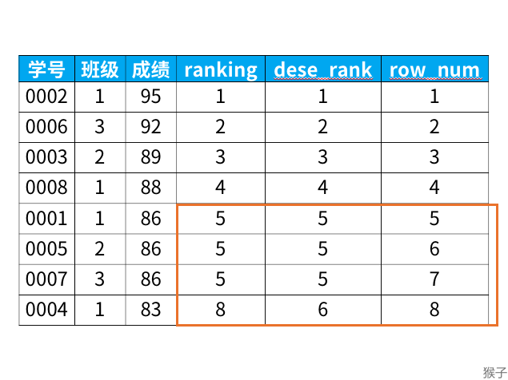

# MySQL
## Title
175. 组合两个表
## Idea
多表的联结又分为以下几种类型：
* 左联结（left join），联结结果保留左表的全部数据
* 右联结（right join），联结结果保留右表的全部数据
* 内联结（inner join），取两表的公共数据


最下方的两种情况的解决方案：
* 左边 
```mysql
SELECT firstName, lastName, city, state
FROM Person A LEFT OUTER JOIN Address B 
ON A.personId = B.personId

union

SELECT firstName, lastName, city, state
FROM Person A RIGHT OUTER JOIN Address B
ON A.personId = B.personId
where A.personId is NULL
```
* 右边
```mysql
SELECT firstName, lastName, city, state
FROM Person A LEFT OUTER JOIN Address B
ON A.personId = B.personId
where B.personId is NULL

union

SELECT firstName, lastName, city, state
FROM Person A RIGHT OUTER JOIN Address B
ON A.personId = B.personId
where A.personId is NULL
```
## Code
```mysql
SELECT firstName, lastName, city, state
FROM Person A LEFT JOIN Address B
ON A.personId = B.personId
```

## Title
176. 第二高的薪水
## Idea
limit 和 offset 函数，ifnull 函数
也可以 where 中嵌套子句 + ifnull 函数
## Code
```mysql
select ifnull(
    (select distinct salary
    from employee
    order by salary desc
    limit 1, 1),
    NULL
) as SecondHighestSalary;

select ifnull(
    (select max(distinct salary)
    from employee
    where salary < (select max(distinct salary) from employee)),
    NULL
    ) as SecondHighestSalary;
```

## Title
177. 第N高的薪水
## Idea
## Code
```mysql
CREATE FUNCTION getNthHighestSalary(N INT) RETURNS INT
BEGIN
DECLARE M INT; 
SET M = N-1; 
  RETURN (
      # Write your MySQL query statement below.
    SELECT DISTINCT salary
    FROM Employee
    ORDER BY salary DESC
    LIMIT M, 1
);
END
```
## Title
分数排名
## Idea
```mysql
select *,
   rank() over (order by 成绩 desc) as ranking,
   dense_rank() over (order by 成绩 desc) as dese_rank,
   row_number() over (order by 成绩 desc) as row_num
from 班级
```

## Code
```mysql
select score, dense_rank() over (order by score desc) as 'rank'
from Scores
```
用rank() over()对num进行开窗排序，原因是连续相同的数字，num的id和rank差值是定值；不连续，差值不同
## Title
使用rank()
## Idea
连续的num
## Code
```mysql
select distinct num as ConsecutiveNums
from
    (select 
        id,
        num,
        cast(row_number() over(order by id) as signed) - cast(rank() over(partition by num order by id) as signed) as diff
    from Logs) a
group by num,diff
having count(*) >=3
```


